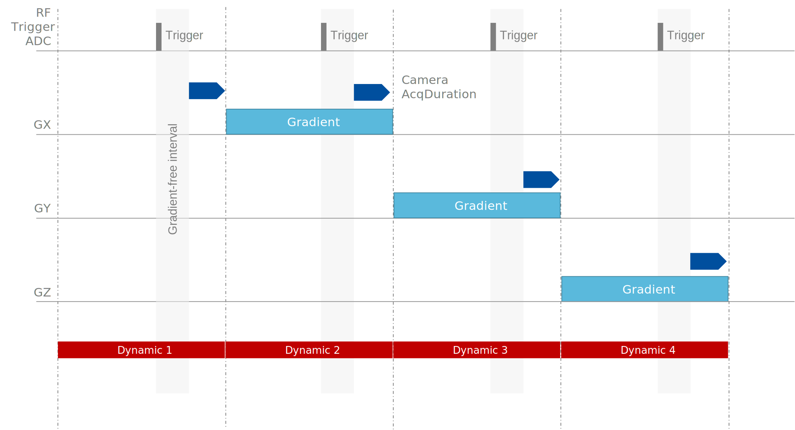
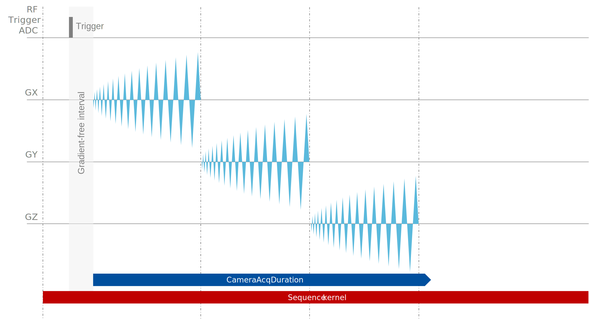

# Pulseq sequences for field-monitoring

This repository contains sequences for calibrating field-monitoring experiments and imaging sequences for demonstration purposes on Siemens scanners. Pulse sequences for Skope Field Camera installation and use on GE scanners can be found under https://github.com/toppeMRI/Skope.

Calibration sequence for all users
 - Off-resonance and position calibration - This sequence is run at the start of each scanning session and after each change of the scanner shim settings, it provides the data to determine the resonance frequency and the position of the probes within the scanner bore.
 
For Clip-On Camera "Cranberry" Edition users
 - Local eddy current calibration - This sequence provides the data needed to quantify eddy currents near individual probes as part of the Local Eddy Current correction provided in the Clip-On Camera "Cranberry" Edition.

Imaging sequences for demonstration
 - Mono-polar 2D dual-echo gradient-echo sequence
 - 2D echo-planar imaging sequence 

Please visit https://github.com/pulseq/pulseq for further information about Pulseq and make sure to use the correct version of the Pulseq interpreter on the scanner.

## Getting started

### Clone this repository  

    git clone https://github.com/SkopeMagneticResonanceTechnologies/Pulseq-Sequences.git

Add Pulseq as a submodule

    git submodule init
    git submodule update
    
### Creating the Pulseq sequence files in MATLAB  

 - Open MATLAB 
 - Run CreateSequences.m to create Pulseq sequence files for all sequences

### NOTES
- The Siemens Pulseq interpreter (1.4.0) flips the polarity of the x-axis. The polarity of the x-gradients for the sequences in this repository has been reversed to deal with this bug. Set the property _signFlip_ to _1_ in PulseqBase.m if you do not wish to flip the sign of the x-gradients.
- If the sequences do not run on the scanner, try closing the protocol and opening it again.

## Acquisition parameters for field-monitoring

The sequence defines the timing of all events for the scanner. Some timing information also needs to be transferred to the Camera Acquisition System. The required values have been added as DEFINITIONS to the header of the Pulseq files. The following tables relates the values in the Pulseq file to the parameters on the graphical user interface of skope-fx. 

| Parameter on GUI of skope-fx | Pulseq definition    | Explanation |
|------------------------------|----------------------|-------------|
| NrDynamics                   | CameraNrDynamics     | Maximum number of acquisitions performed by the Camera Acquisition System. The actual number of acquired dynamics will be smaller if triggers are being skipped.|
| InterleaveTR                 | CameraInterleaveTR   | If the time between subsequent triggers is smaller than the CameraInterleaveTR (blank time), the subsequent triggers will be ignored for the duration of the CameraInterleaveTR. This parameter can be used to skip triggers in case of rapid imaging. |
| Aq Duration                  | CameraAcqDuration    | Duration of the acquisition performed on the Camera Acquisition System.|
| Aq Delay                     | CameraAqDelay        | Delay between the reception of the trigger and the start of the acquisition on the Camera Acquisition System. |
| Nr Sync Dynamics             | CameraNrSyncDynamics | Number of acquisitions to be performed for data synchronization. |

Note that the time unit is seconds in the Pulseq file and milliseconds on the graphical user interface of skope-fx.

## Acquisition parameters for image reconstruction

Some additional timing values are required to merge camera and scanner data and to perform image reconstruction. 

A rough estimate of the delay between the start of the trigger and the first scanner ADC sample is needed for the synchronization of the camera and scanner data. This value has been added to the DEFINITIONS structure of the Pulseq file.

    TriggerToScannerAcqDelay

Additional timing information is required for data merging and image reconstruction.

**GRE** 

    TE

**EPI**

    TE
    EchoSpacing
    EchoTrainLength

## Sequences

### Off-resonance and position calibration (OPC)

At the start of each scanning session and after each change of the scanner shim settings, this calibration sequence is used to determine the resonance frequency and the position of the probes within the scanner bore. It consists of four acquisitions. The first acquisition is performed in the absence of any applied gradient. The other three acquisitions are performed while a gradient of 2.5 mT/m is played out on either of the three physical axes.

Please do not change the timings used by this sequence. The calibration wizard in skope-fx uses the set values as default values.

### Local eddy current calibration (LEC)

Local eddy currents can disturb the fields measured by individual probes. The implemented sequence allows to quantify these eddy currents by playing out a series of gradient blips on each physical axis of the gradient system. 

Please do not change the timing or the number of blips used by this sequence. The calibration wizard in skope-fx relies on correct timing of these events in the sequence.

### 2D gradient echo (GRE) sequence

The implemented sequence acquires two mono-polar echoes for five slices. The data is acquired in an interleaved fashion meaning that the innermost loop of the sequence is the slice index. A repetition time (TR) of 25 ms has been selected as default value. With an interleave TR of 124.5 ms, four triggers will be skipped and every fifth scanner acquisition will be monitored. Hence, the first slice will be fully monitored. The k-space trajectories for the other slices could be deduced from the data of the first slice.

The figure below shows the kernel of the GRE sequence. It is repeated 640 (= 128 [lines] * 5 [slices]) times to acquire the entire image. 

The same kernel is repeated 10 times without RF at the start of the scan to acquire synchronization data. During this pre-scan, the Camera Acquisition System transmits amplitude-modulated pulses at the proton frequency. The data can be used to calculate the delay between scanner and camera data. A pause of 4s separates the synchronization pre-scan from the actual imaging experiment.

Set the following values on the Camera Acquisition System:

    CameraNrDynamics     640 
    CameraInterleaveTR   124.5 ms
    CameraAcqDuration    13 ms 
    CameraAqDelay        0  ms   
    CameraNrSyncDynamics 10

Due to trigger skipping, the Camera Acquisition System will not acquire all 640 dynamics but it will still register them. Press *Stop Scan* on the graphical user interface of skope-fx once the scanner has finished. 

### 2D echo planar (EPI) sequence

The figure below shows the kernel for the EPI sequence. It is repeated 5 times to acquire all slices. As for the GRE sequence, 10 synchronization pre-scans are played out before the actual imaging scan.

Set the following values on the Camera Acquisition System:

    CameraNrDynamics     5
    CameraInterleaveTR   299.5 ms 
    CameraAcqDuration    58 ms 
    CameraAqDelay        0  ms   
    CameraNrSyncDynamics 10

Due to trigger skipping, the Camera Acquisition System will not acquire all 5 dynamics. Press *Stop Scan* on the graphical user interface of skope-fx once the scanner has finished. 

## Pulseq files

The Pulseq files included in this repository have been created for a 7T Siemens whole-body system.

## Warranties

THE SEQUENCES ARE PROVIDED "AS IS" WITHOUT WARRANTY OF ANY KIND EXPRESS OR IMPLIED, AND TO THE MAXIMUM EXTENT PERMITTED BY THE APPLICABLE LAW. EXCEPT AS EXPRESSLY PROVIDED IN THIS CLAUSE, NO WARRANTY, CONDITION, UNDERTAKING, LIABILITY OR TERM, EXPRESS OR IMPLIED, STATUTORY OR OTHERWISE, AS TO CONDITION, QUALITY, PERFORMANCE, FUNCTIONALITY, INFRINGEMENT, MERCHANTABILITY, DURABILITY OR FITNESS FOR PURPOSE, IS GIVEN OR ASSUMED BY SKOPE AG, LICENSOR OR ITS LICENSORS AND ALL SUCH WARRANTIES, CONDITIONS, UNDERTAKINGS AND TERMS ARE HEREBY EXCLUDED.

## Disclaimer

The sequences *are not* medical device applications. The sequences and any resulting data are to be used for research purposes only and *not* to diagnose, treat, cure or prevent any disease. Skope Magnetic Resonance Technologies makes no representation and assumes no responsibility for the misuse of these sequences.
Skope Magnetic Resonance Technologies does not take any responsibility or liability for damages, harm, loss of data or similar incidents that are in direct or indirect relation to the usage or presence of any of its devices. MR sequences or particular implementations thereof can be subject to intellectual property of one or several parties.

The information available in this repository, including text, graphics, images, and information contained on or in said repository is not intended as medical advice or a substitute for obtaining medical advice. Skope Magnetic Resonance Technologies does not recommend or endorse any specific tests, products, procedures, or other information that may be mentioned in this manual, especially in place of physician recommended care. You are encouraged to confirm any and all information obtained from or through this repository without your physician or other medical professional. Never disregard professional medical advice or delay seeking medical treatment because of something you have access through Skope Magnetic Resonance Technologies.

The statements made regarding the sequences *have not* been evaluated by the Food and Drug Administration or like authorities. The safety and efficacy of the sequences *has not* been confirmed by FDA-approved or likewise approved research. The sequences *are not* intended to diagnose, treat, cure or prevent any disease.
The content of this repository can change without notice.

© COPYRIGHT 2022 by Skope Magnetic Resonance Technologies AG
